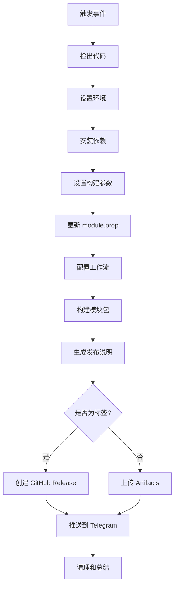

# GitHub Actions 工作流总结

## 🎯 已创建的文件

### 1. 主要工作流文件
- **`.github/workflows/build-and-push.yml`** - 主要的 GitHub Actions 工作流
- **`.github/telegram_push.py`** - 简化的 Telegram 推送脚本
- **`test_telegram.sh`** - Telegram 推送功能测试脚本
- **`GITHUB_ACTIONS_SETUP.md`** - 详细的设置指南

## 🚀 工作流功能

### 自动化构建
- ✅ 支持多种代理核心（sing-box, clash, xray, v2fly, hysteria）
- ✅ 支持多种网络模式（enhance, tproxy, redirect, mixed, tun）
- ✅ 支持多种 UI 界面（zashboard, yacd, metacubexd）
- ✅ 自动版本管理和文件命名
- ✅ 构建产物上传和存储

### Telegram 推送
- ✅ 自动推送到指定群组/频道
- ✅ 支持话题模式（MESSAGE_THREAD_ID）
- ✅ 美观的消息格式
- ✅ 错误处理和重试机制

### 触发方式
- ✅ 推送到主分支自动构建
- ✅ 创建标签自动发布
- ✅ 手动触发支持自定义配置
- ✅ Pull Request 构建测试

## 🔧 必需的 GitHub Secrets

| Secret 名称 | 描述 | 示例 |
|------------|------|------|
| `BOT_TOKEN` | Telegram Bot Token | `123456789:ABCdef...` |
| `CHAT_ID` | 目标 Chat ID | `123456789` (私聊) 或 `-1001234567890` (群组) |

## 📱 使用方法

### 1. 设置 GitHub Secrets
```bash
# 在 GitHub 仓库设置中添加以上 Secrets
Settings → Secrets and variables → Actions → New repository secret
```

### 2. 自动触发
```bash
# 推送到主分支
git push origin main

# 创建标签发布
git tag v1.8.1
git push origin v1.8.1
```

### 3. 手动触发
1. 进入 GitHub Actions 页面
2. 选择 "Build and Push to Telegram" 工作流
3. 点击 "Run workflow"
4. 选择配置选项并运行

### 4. 本地测试 Telegram 推送
```bash
# 设置环境变量
export BOT_TOKEN="your_bot_token"
export CHAT_ID="your_chat_id"

# 运行测试
./test_telegram.sh
```

## 📦 构建产物

### 文件命名格式
```
box_for_root-{version}-{core}-{network_mode}.zip
```

### 存储位置
- **GitHub Artifacts**: 30 天保存期
- **GitHub Releases**: 永久保存（标签推送时）
- **Telegram**: 推送到指定群组

## 🎨 自定义配置示例

### 默认配置（推荐）
```yaml
core: sing-box
network_mode: enhance
ui: zashboard
```

### 游戏优化配置
```yaml
core: hysteria
network_mode: tun
ui: yacd
```

### 企业稳定配置
```yaml
core: xray
network_mode: redirect
ui: metacubexd
```

### 轻量级配置
```yaml
core: v2fly
network_mode: mixed
ui: yacd
```

## 📊 工作流执行流程



## 🔍 故障排除

### 常见问题

#### 1. Telegram 推送失败
```
❌ 错误: 缺少必需的环境变量 BOT_TOKEN
```
**解决方案**: 检查 GitHub Secrets 设置

#### 2. 构建失败
```
❌ 错误: 缺少依赖
```
**解决方案**: 工作流会自动安装依赖，检查网络连接

#### 3. 权限问题
```
❌ 错误: Chat not found
```
**解决方案**: 确认 Bot 已添加到目标群组且有发送权限

### 调试方法

#### 1. 查看工作流日志
- 进入 Actions 页面查看详细日志

#### 2. 本地测试
```bash
# 测试 Telegram 推送
./test_telegram.sh

# 测试工作流脚本
./workflow_generator.sh --help
```

#### 3. 跳过推送测试
- 手动触发时勾选 "跳过 Telegram 推送"

## 🎉 完成状态

### ✅ 已实现功能
1. **完整的 GitHub Actions 工作流**
2. **多配置支持和自定义选项**
3. **Telegram Bot 自动推送**
4. **GitHub Release 自动创建**
5. **构建产物管理**
6. **详细的错误处理和日志**
7. **本地测试工具**
8. **完整的文档和设置指南**

### 🚀 立即开始使用

1. **设置 Secrets**: 在 GitHub 仓库中添加必需的 Secrets
2. **推送代码**: 推送到主分支触发自动构建
3. **创建标签**: 创建标签发布新版本
4. **手动触发**: 使用自定义配置手动构建

### 📚 相关文档
- **详细设置**: `GITHUB_ACTIONS_SETUP.md`
- **工作流指南**: `WORKFLOW_GUIDE.md`
- **使用示例**: `EXAMPLES.md`

现在您的 Box for Magisk 项目具备了完整的 CI/CD 能力，可以自动构建、测试和推送到 Telegram Bot！🎊
