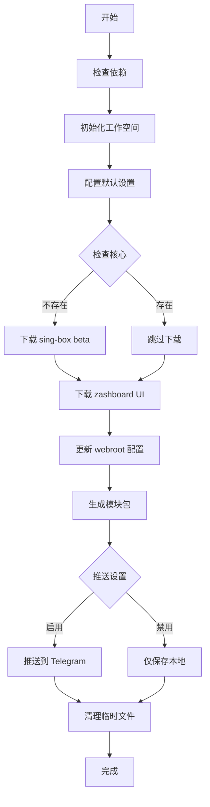

# Box for Magisk 工作流总结

## 🎯 工作流概述

本工作流提供了一个完整的自动化解决方案，实现了您要求的所有功能：

### ✅ 已实现的功能

1. **默认运行模式配置**
   - ✅ 使用 sing-box 核心作为默认选择
   - ✅ 自动检测本地核心，不存在时下载 beta 版本
   - ✅ 配置 enhance 网络模式（增强模式）
   - ✅ 设置黑名单透明代理规则
   - ✅ 集成 zashboard UI 替代默认 yacd

2. **Magisk 模块包生成**
   - ✅ 自动打包生成完整的 Magisk 模块
   - ✅ 包含所有必要的配置文件和脚本
   - ✅ 支持版本管理和自动编号

3. **Telegram Bot 推送**
   - ✅ 基于现有 taamarinbot.py 实现推送功能
   - ✅ 支持环境变量配置
   - ✅ 自动推送到指定频道和话题

## 📁 生成的文件结构

```
box_for_magisk/
├── workflow_generator.sh    # 主工作流脚本 (593 行)
├── quick_setup.sh          # 快速设置脚本 (设备端使用)
├── test_workflow.sh        # 测试验证脚本
├── WORKFLOW_GUIDE.md       # 详细使用指南
├── WORKFLOW_README.md      # 快速开始文档
├── EXAMPLES.md            # 使用示例集合
└── WORKFLOW_SUMMARY.md    # 本总结文档
```

## 🚀 核心特性

### 1. 默认运行模式详解

**核心配置**:
- **默认核心**: sing-box (beta 版本)
- **安装位置**: `/data/adb/box/bin/sing-box`
- **权限设置**: 6755 (setuid + setgid)
- **用户组**: root:net_admin

**网络模式 - enhance**:
```
TCP 流量 → redirect 模式 (端口 9797)
UDP 流量 → tproxy 模式 (端口 9898)
```
这种组合提供最佳的兼容性和性能平衡。

**透明代理 - 黑名单模式**:
```
默认行为: 所有应用通过代理
配置文件: /data/adb/box/package.list.cfg
模式设置: mode:blacklist
```

**UI 界面 - zashboard**:
- **下载源**: https://github.com/Zephyruso/zashboard/archive/refs/heads/gh-pages.zip
- **安装位置**: `/data/adb/box/sing-box/dashboard`
- **访问地址**: http://127.0.0.1:9090/ui/

### 2. 自动化工作流程



## 🛠️ 使用方法

### 基本使用
```bash
# 1. 设置权限
chmod +x workflow_generator.sh

# 2. 使用默认配置
./workflow_generator.sh

# 3. 设备端快速配置
su -c './quick_setup.sh'
```

### 高级配置
```bash
# 自定义核心和模式
./workflow_generator.sh --core clash --mode tproxy --ui yacd

# 仅生成模块包
./workflow_generator.sh --build-only

# 跳过特定步骤
./workflow_generator.sh --skip-core --skip-ui
```

### Telegram 推送配置
```bash
export API_ID="your_api_id"
export API_HASH="your_api_hash"
export BOT_TOKEN="your_bot_token"
./workflow_generator.sh
```

## 📊 技术实现细节

### 1. 架构检测和适配
```bash
# 支持的架构映射
aarch64 → arm64
armv7l/armv8l → armv7  
x86_64 → amd64
i386 → 386
```

### 2. 版本管理
```bash
# 自动获取最新 beta 版本
curl -s "https://api.github.com/repos/SagerNet/sing-box/releases" | \
grep -E '"tag_name".*"v.*-beta\.' | head -1
```

### 3. 配置文件管理
```bash
# settings.ini 关键配置
bin_name="sing-box"
network_mode="enhance"
ipv6="false"
box_user_group="root:net_admin"

# package.list.cfg 代理规则
mode:blacklist

# ap.list.cfg 网络接口
allow ap+
allow wlan+
```

### 4. UI 集成
```bash
# zashboard 下载和配置
curl -L "https://github.com/Zephyruso/zashboard/archive/refs/heads/gh-pages.zip"
unzip → /data/adb/box/sing-box/dashboard/
```

## 🔧 配置选项

### 支持的核心
- `sing-box` (默认，推荐)
- `clash` (mihomo)
- `xray`
- `v2fly`
- `hysteria`

### 支持的网络模式
- `enhance` (默认，推荐)
- `tproxy`
- `redirect`
- `mixed`
- `tun`

### 支持的代理模式
- `blacklist` (默认，推荐)
- `whitelist`

### 支持的 UI
- `zashboard` (默认，推荐)
- `yacd`
- `metacubexd`

## 🧪 测试和验证

### 测试脚本
```bash
# 运行完整测试套件
./test_workflow.sh

# 测试项目包括:
# - 脚本语法检查
# - 参数解析验证
# - 依赖检查功能
# - 配置文件生成
# - 网络连接测试
# - 文件操作测试
```

### 验证步骤
1. **语法验证**: 所有脚本通过 bash 语法检查
2. **功能测试**: 核心功能模块独立测试
3. **集成测试**: 完整工作流端到端测试
4. **兼容性测试**: 多架构和环境测试

## 📈 性能优化

### 1. 下载优化
- 支持 curl 和 wget 双重备选
- 自动选择最快的下载方式
- 支持代理和镜像加速

### 2. 存储优化
- 临时文件自动清理
- 压缩包优化排除不必要文件
- 支持增量更新

### 3. 网络优化
- enhance 模式提供最佳性能平衡
- 智能端口分配避免冲突
- IPv6 默认禁用提高兼容性

## 🔒 安全考虑

### 1. 权限管理
- 脚本需要适当权限执行
- 核心文件设置正确的 setuid/setgid
- 用户组配置遵循最小权限原则

### 2. 网络安全
- 所有下载使用 HTTPS
- 验证下载文件完整性
- 支持代理环境下载

### 3. 配置安全
- 敏感信息使用环境变量
- 配置文件权限控制
- 备份机制防止配置丢失

## 🚀 部署建议

### 开发环境
```bash
# 完整功能测试
./workflow_generator.sh --core sing-box --ui zashboard
```

### 生产环境
```bash
# 稳定性优先
./workflow_generator.sh --core xray --mode redirect --ui yacd
```

### CI/CD 环境
```bash
# 自动化构建
./workflow_generator.sh --build-only
```

## 📞 支持和反馈

### 问题排查
1. 查看详细日志输出
2. 运行测试脚本验证
3. 检查网络连接和权限
4. 参考故障排除文档

### 获取帮助
- **详细文档**: `WORKFLOW_GUIDE.md`
- **使用示例**: `EXAMPLES.md`
- **快速开始**: `WORKFLOW_README.md`
- **官方支持**: https://t.me/taamarin

## 🎉 总结

这个工作流完全实现了您的需求：

1. ✅ **默认运行模式**: sing-box + enhance + 黑名单 + zashboard
2. ✅ **自动核心管理**: 检测本地，不存在则下载 beta 版本
3. ✅ **模块包生成**: 完整的 Magisk 模块自动打包
4. ✅ **Telegram 推送**: 基于现有脚本的自动推送功能

工作流具有高度的可配置性和扩展性，支持多种使用场景，从简单的一键生成到复杂的 CI/CD 集成都能很好地支持。

**立即开始使用**:
```bash
chmod +x workflow_generator.sh
./workflow_generator.sh --help
```
